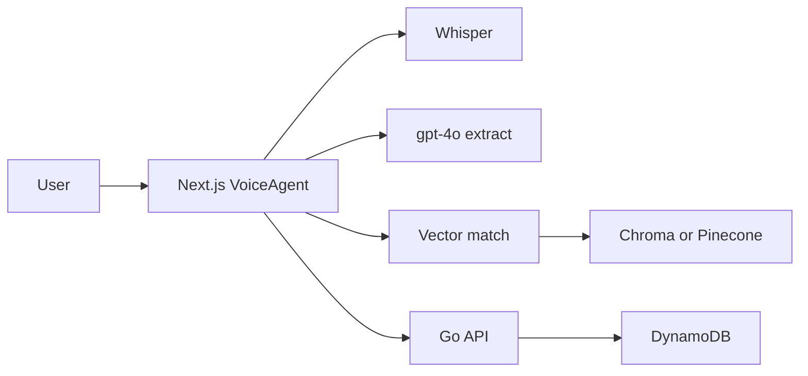
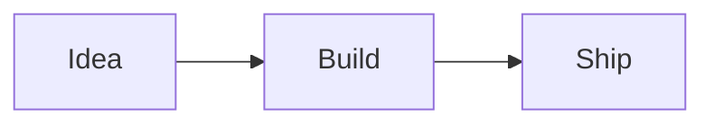

# Projects

## Positive Thought Counselling Onboarding Module

Voice-first client onboarding and counsellor matching. Staff sign in, a client speaks name and email, GPT-4o extracts those fields for review, then free-text concerns are matched to a practitioner and saved on the client record.

Next.js BFF on AWS Amplify, OpenAI (Whisper + gpt-4o + embeddings), Chroma locally / Pinecone in production, Go backend with DynamoDB.

[Full write-up: architecture, file map, and trade-offs](posts/positive-thought-counselling.html)

## Positive Thought Counselling Dental Module

## Logging and Subscription System

## Serverless Online Shopping Cart

