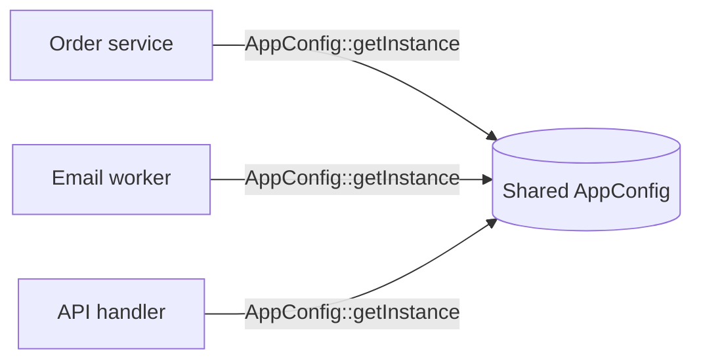
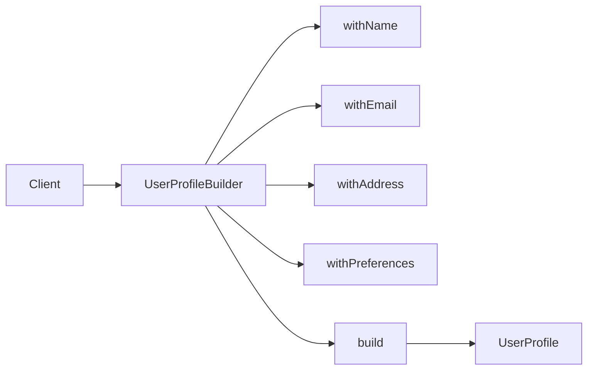
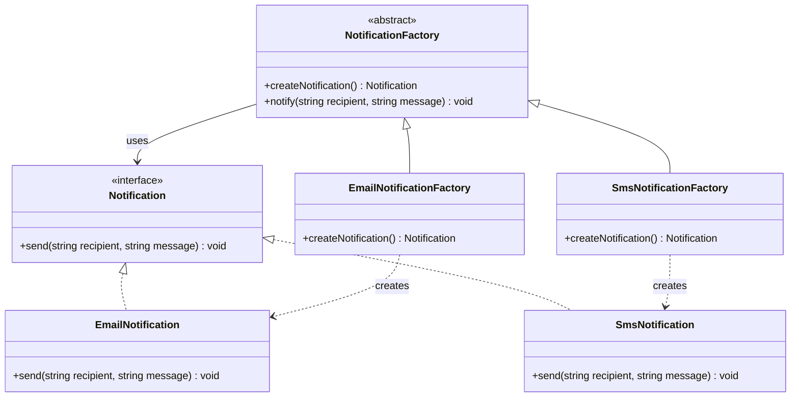
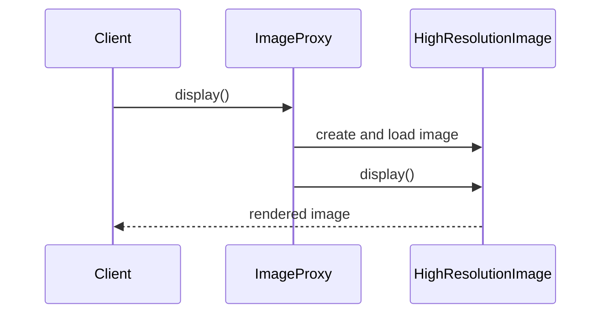
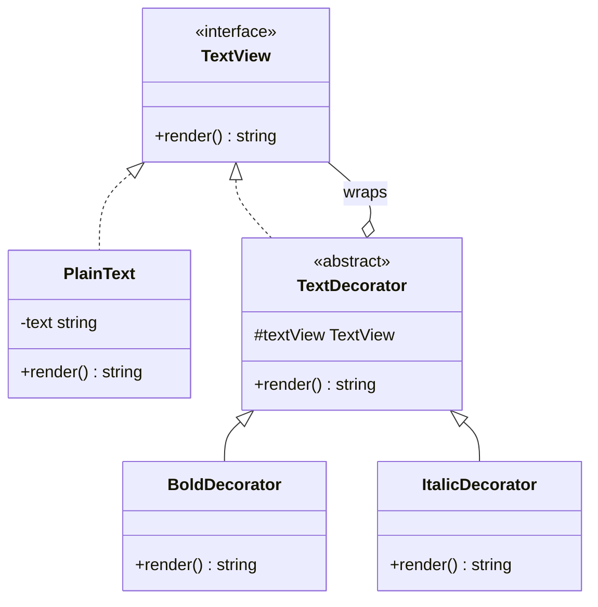
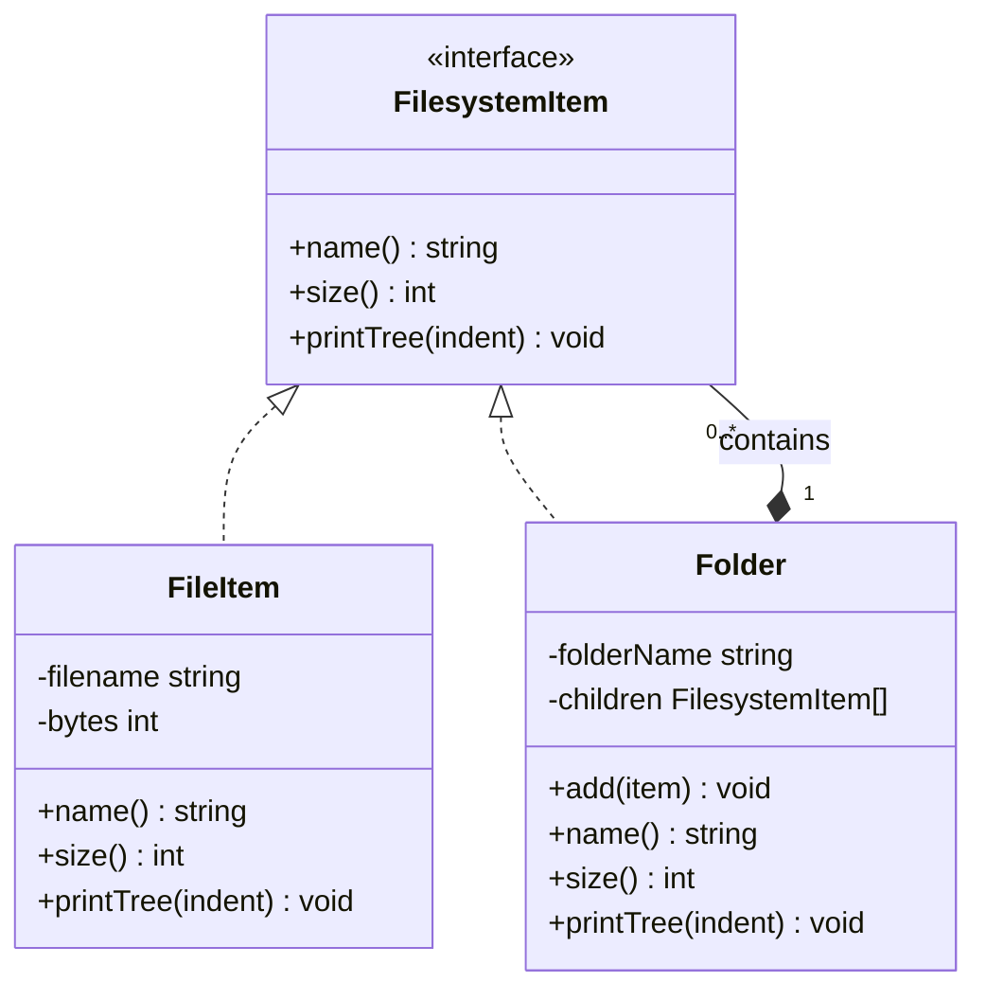

---

## title: 'Design Patterns'

description: 'Reusable solutions within a system architecture'
category: 'System Design'
author: 'John Mason'
date: '2026-08-19 12:00'

- **System design** defines a high-level blueprint for a system's overall architecture.
- **Design patterns** offer mid-level, reusable solutions for recurring challenges within that architecture.

## References

- [Refactoring Guru — Design Patterns](https://refactoring.guru/design-patterns)
- Gang of Four (23 Patterns)
- [Algomaster Blog -](https://www.youtube.com/watch?v=rpt8PpIPhJQ)

## Creational

- Objects are created

### Singleton

One shared instance of a class eg app config, logger, cache manager and thread pool




```php
final class AppConfig
{
    private static ?self $instance = null;

    private function __construct(
        public readonly string $environment = 'production',
    ) {}

    private function __clone(): void {}

    public function __wakeup(): void
    {
        throw new LogicException('Cannot unserialize a singleton.');
    }

    public static function getInstance(): self
    {
        return self::$instance ??= new self();
    }
}

final class OrderService
{
    public function config(): AppConfig
    {
        return AppConfig::getInstance();
    }
}

final class EmailWorker
{
    public function config(): AppConfig
    {
        return AppConfig::getInstance();
    }
}

final class ApiHandler
{
    public function config(): AppConfig
    {
        return AppConfig::getInstance();
    }
}

$orderService = new OrderService();
$emailWorker = new EmailWorker();
$apiHandler = new ApiHandler();

assert($orderService->config() === $emailWorker->config());
assert($emailWorker->config() === $apiHandler->config());
```

### Builder

- Helps construct one complex object

For example, a user profile with many optional fields.




```php
final readonly class UserProfile
{
    public function __construct(
        public string $name,
        public string $email,
        public ?string $address,
        public array $preferences,
    ) {}
}

final class UserProfileBuilder
{
    private string $name = '';
    private string $email = '';
    private ?string $address = null;
    private array $preferences = [];

    public function withName(string $name): self
    {
        $this->name = $name;

        return $this;
    }

    public function withEmail(string $email): self
    {
        $this->email = $email;

        return $this;
    }

    public function withAddress(string $address): self
    {
        $this->address = $address;

        return $this;
    }

    public function withPreferences(array $preferences): self
    {
        $this->preferences = $preferences;

        return $this;
    }

    public function build(): UserProfile
    {
        return new UserProfile(
            name: $this->name,
            email: $this->email,
            address: $this->address,
            preferences: $this->preferences,
        );
    }
}

$profile = (new UserProfileBuilder())
    ->withName('Ada Lovelace')
    ->withEmail('ada@example.com')
    ->withPreferences(['newsletter' => true])
    ->build();
```

### Factory

Creates objects without requiring the client to know their concrete classes. For example, email and SMS notification services can be created through their respective notification factories.

Client uses notification workflow without knowing how the internal details are created  this avoids duplication in the code base

NotificationFactory is abstract because it defines the shared notification workflow but cannot decide which notification type to create.




```php
interface Notification
{
    public function send(string $recipient, string $message): void;
}

final class EmailNotification implements Notification
{
    public function send(string $recipient, string $message): void
    {
        echo "Email sent to {$recipient}: {$message}";
    }
}

final class SmsNotification implements Notification
{
    public function send(string $recipient, string $message): void
    {
        echo "SMS sent to {$recipient}: {$message}";
    }
}

abstract class NotificationFactory
{
    abstract public function createNotification(): Notification;

    public function notify(string $recipient, string $message): void
    {
        $notification = $this->createNotification();
        $notification->send($recipient, $message);
    }
}

final class EmailNotificationFactory extends NotificationFactory
{
    public function createNotification(): Notification
    {
        return new EmailNotification();
    }
}

final class SmsNotificationFactory extends NotificationFactory
{
    public function createNotification(): Notification
    {
        return new SmsNotification();
    }
}

$emailFactory = new EmailNotificationFactory();
$emailFactory->notify('ada@example.com', 'Your order has shipped.');

$smsFactory = new SmsNotificationFactory();
$smsFactory->notify('+441234567890', 'Your order has shipped.');
```

## Structural

How objects are organized and combined

### Adapter

Helps two components work together when their interfaces do not match.

For example, an application expects a payment gateway with a `charge` method, but a
third-party gateway provides a `makePayment` method. An adapter translates between them.


```php
interface PaymentGateway
{
    public function charge(int $amountInCents): bool;
}

final class ThirdPartyPaymentGateway
{
    public function makePayment(int $amountInCents): bool
    {
        // Send the payment request to the third-party provider.
        return true;
    }
}

final class PaymentGatewayAdapter implements PaymentGateway
{
    public function __construct(
        private readonly ThirdPartyPaymentGateway $gateway,
    ) {}

    public function charge(int $amountInCents): bool
    {
        return $this->gateway->makePayment($amountInCents);
    }
}

final class CheckoutService
{
    public function __construct(
        private readonly PaymentGateway $gateway,
    ) {}

    public function checkout(int $amountInCents): bool
    {
        return $this->gateway->charge($amountInCents);
    }
}

$gateway = new PaymentGatewayAdapter(new ThirdPartyPaymentGateway());
$checkout = new CheckoutService($gateway);

$checkout->checkout(4999);
```

### Facade

Provides one simple method over a complex workflow. (Access to a complicated system)

For example, a video publishing facade can hide a five-step process so its orchestration
logic is not duplicated throughout the application.


```php
final class VideoValidator
{
    public function validate(string $videoPath): void
    {
        // Verify the file format, size, and duration.
    }
}

final class VideoTranscoder
{
    public function transcode(string $videoPath): string
    {
        return '/tmp/video-1080p.mp4';
    }
}

final class ThumbnailGenerator
{
    public function generate(string $videoPath): string
    {
        return '/tmp/thumbnail.jpg';
    }
}

final class VideoStorage
{
    public function upload(string $videoPath, string $thumbnailPath): string
    {
        return 'https://videos.example.com/video-123';
    }
}

final class SubscriberNotifier
{
    public function notify(string $videoUrl): void
    {
        // Notify subscribers that the video is available.
    }
}

final class VideoPublishingFacade
{
    public function __construct(
        private readonly VideoValidator $validator,
        private readonly VideoTranscoder $transcoder,
        private readonly ThumbnailGenerator $thumbnailGenerator,
        private readonly VideoStorage $storage,
        private readonly SubscriberNotifier $notifier,
    ) {}

    public function publish(string $videoPath): string
    {
        $this->validator->validate($videoPath);
        $transcodedVideo = $this->transcoder->transcode($videoPath);
        $thumbnail = $this->thumbnailGenerator->generate($transcodedVideo);
        $videoUrl = $this->storage->upload($transcodedVideo, $thumbnail);
        $this->notifier->notify($videoUrl);

        return $videoUrl;
    }
}

$publisher = new VideoPublishingFacade(
    new VideoValidator(),
    new VideoTranscoder(),
    new ThumbnailGenerator(),
    new VideoStorage(),
    new SubscriberNotifier(),
);

$videoUrl = $publisher->publish('/uploads/my-video.mov');
```

### Proxy

A proxy places a substitute object in front of a real object to control access to it.
For example, an image proxy can delay loading a high-resolution image until it is displayed.




```php
interface Image
{
    public function display(): void;
}

final class HighResolutionImage implements Image
{
    public function __construct(
        private readonly string $filename,
    ) {
        $this->loadFromDisk();
    }

    private function loadFromDisk(): void
    {
        echo "Loading {$this->filename} from disk.\n";
    }

    public function display(): void
    {
        echo "Displaying {$this->filename}.\n";
    }
}

final class ImageProxy implements Image
{
    private ?HighResolutionImage $image = null;

    public function __construct(
        private readonly string $filename,
    ) {}

    public function display(): void
    {
        // Create the expensive object only when it is first needed.
        $this->image ??= new HighResolutionImage($this->filename);
        $this->image->display();
    }
}

$image = new ImageProxy('high-resolution-photo.jpg');

// The real image is loaded only on the first call.
$image->display();
$image->display();
```

### Decorator

Adds new behavior to an object without altering its class. For example, a rich-text editor can wrap a text view with bold and italic decorators.
each decorater has one responsibility and delegates the rest of the activity to the object it traps
adds one object and adds beahvior around it doesnt change client behavior 




```php
interface TextView
{
    public function render(): string;
}

final class PlainText implements TextView
{
    public function __construct(
        private readonly string $text,
    ) {}

    public function render(): string
    {
        return htmlspecialchars($this->text, ENT_QUOTES, 'UTF-8');
    }
}

abstract class TextDecorator implements TextView
{
    public function __construct(
        protected readonly TextView $textView,
    ) {}
}

final class BoldDecorator extends TextDecorator
{
    public function render(): string
    {
        return "<strong>{$this->textView->render()}</strong>";
    }
}

final class ItalicDecorator extends TextDecorator
{
    public function render(): string
    {
        return "<em>{$this->textView->render()}</em>";
    }
}

$text = new PlainText('Decorator pattern');
$formattedText = new ItalicDecorator(new BoldDecorator($text));

echo $formattedText->render();
// <em><strong>Decorator pattern</strong></em>
```

### Composite

The Composite pattern lets clients treat a single object and a group of objects through the same interface. For example, files and folders can both report their name and size, while a folder delegates to its children.




```php
interface FilesystemItem
{
    public function name(): string;

    public function size(): int;

    public function printTree(string $indent = ''): void;
}

final class FileItem implements FilesystemItem
{
    public function __construct(
        private readonly string $filename,
        private readonly int $bytes,
    ) {}

    public function name(): string
    {
        return $this->filename;
    }

    public function size(): int
    {
        return $this->bytes;
    }

    public function printTree(string $indent = ''): void
    {
        echo "{$indent}{$this->name()} ({$this->size()} bytes)\n";
    }
}

final class Folder implements FilesystemItem
{
    /** @var FilesystemItem[] */
    private array $children = [];

    public function __construct(
        private readonly string $folderName,
    ) {}

    public function add(FilesystemItem $item): void
    {
        $this->children[] = $item;
    }

    public function name(): string
    {
        return $this->folderName;
    }

    public function size(): int
    {
        return array_sum(
            array_map(
                fn (FilesystemItem $item): int => $item->size(),
                $this->children,
            ),
        );
    }

    public function printTree(string $indent = ''): void
    {
        echo "{$indent}{$this->name()}/ ({$this->size()} bytes)\n";

        foreach ($this->children as $child) {
            $child->printTree($indent . '  ');
        }
    }
}

$images = new Folder('images');
$images->add(new FileItem('logo.svg', 2_048));
$images->add(new FileItem('hero.jpg', 120_000));

$project = new Folder('project');
$project->add(new FileItem('README.md', 1_024));
$project->add($images);

$project->printTree();
// project/ (123072 bytes)
//   README.md (1024 bytes)
//   images/ (122048 bytes)
//     logo.svg (2048 bytes)
//     hero.jpg (120000 bytes)
```

## Behavioral

objects communicate and divide responsibilities

### Strategy

### Observer

### State

### Command

### Template Method

### Iterator

### Chain fo Responsibility

