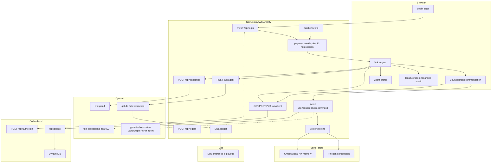
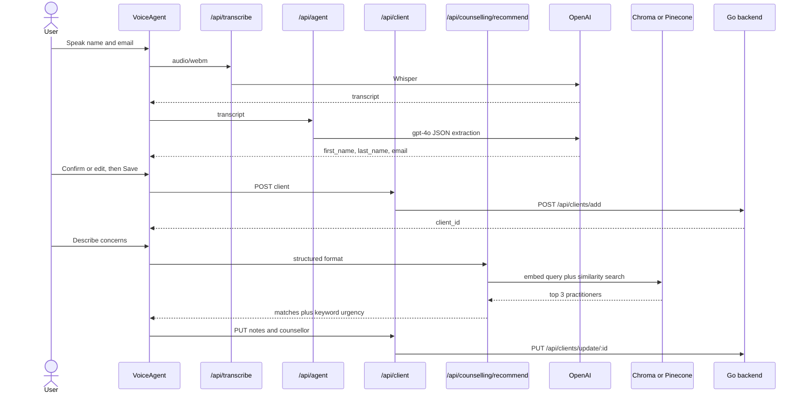

A voice-first client onboarding and counsellor-matching app for a New Zealand counselling practice. A staff member (or client) signs in, speaks their name and email, reviews what the model extracted, then describes why they are seeking help so the system can recommend a matching practitioner and persist the intake on a client record.

This frontend is a Next.js 14 App Router application. It talks to OpenAI for speech and language, a vector store for practitioner search, and a separate Go backend (DynamoDB behind API Gateway) for auth and client persistence. Production hosting is AWS Amplify.

## What it does

The product is an **intake workflow**, not a full practice-management suite.

1. **Sign in.** Credentials go to the Go backend; this app stores an HTTP-only session cookie.
2. **Create account by voice.** The browser records audio (WebM), Whisper transcribes it, and GPT-4o extracts first name, last name, and email. The user can edit before save.
3. **Persist the client.** A BFF route (`/api/client`) proxies create/read/update to the Go API.
4. **Match a counsellor.** The client describes their concerns in free text. Semantic search over seven seeded practitioners returns ranked matches plus a keyword-based urgency level. Choosing a counsellor writes `requested_counsellor` and `urgency` back to the profile. The intake text is stored as initial consult notes.
5. **Resume after refresh.** The saved email is kept in `localStorage` so the profile can be reloaded without repeating voice onboarding.

What is **not** in this frontend repo: calendar booking, the Go/DynamoDB backend itself, and the dental image-screening service mentioned in the README.

## Architecture



### Request path in practice



The Next.js app is a **BFF**: the browser never calls OpenAI or the Go API directly (except that `NEXT_PUBLIC_BACKEND_URL` is also available on the client). Secrets stay in Amplify env vars / server routes. Vector search is switched with `USE_LOCAL_VECTOR_DB`: Chroma locally, Pinecone in production. Both use the same OpenAI embedding model so indexes stay compatible.

## Directory and file structure

```
WhatsTheScore/
├── app/                          Next.js App Router UI and API routes.
│   ├── layout.tsx                Root layout: Unsplash background and page chrome.
│   ├── page.tsx                  Authenticated home. Checks auth cookies, enforces a 30-minute session, renders VoiceAgent.
│   ├── globals.css               Global Tailwind / CSS entry.
│   ├── login/
│   │   └── page.tsx              Sign-in form. Posts email/password to /api/login, then redirects home.
│   ├── components/
│   │   ├── VoiceAgent.tsx        Main onboarding UI: mic recording, transcript review, save client, counsellor finder, profile.
│   │   ├── CounsellingRecommendation.tsx  Concern textarea, match request, persist notes and chosen counsellor.
│   │   ├── Client.tsx            ClientData type plus read-only profile fields.
│   │   ├── Client.test.tsx       Jest tests for the profile component.
│   │   ├── Logo.tsx              positive THOUGHT Counselling wordmark.
│   │   └── ResetOnboardingButton.tsx  Clears localStorage and resets VoiceAgent without logging out.
│   └── api/
│       ├── login/route.ts        Proxies login to the Go backend and sets httpOnly authToken plus loginTime cookies.
│       ├── logout/route.ts       Deletes auth cookies locally (does not call the backend yet).
│       ├── transcribe/route.ts   Accepts recorded audio and returns a Whisper transcript.
│       ├── agent/route.ts        Asks gpt-4o to extract first_name, last_name, email as JSON; logs to SQS.
│       ├── client/route.ts       BFF for GET-by-email, POST create, and PUT notes/counsellor against the Go API.
│       ├── client/route.test.ts  Jest tests for client proxy create/update behaviour.
│       └── counselling/
│           └── recommend/route.ts  Runs practitioner matching; GET returns vector-store health/config.
├── lib/
│   ├── counselling/
│   │   ├── types.ts              Practitioner, issue input, and recommendation TypeScript types.
│   │   ├── sample-practitioners.ts  Seven hardcoded counsellors used to seed the vector index.
│   │   ├── embeddings.ts         OpenAI embeddings helper, document mapping, seed and search helpers.
│   │   ├── vector-store.ts       Chroma vs Pinecone switch, plus a Pinecone v7 upsert fallback.
│   │   ├── pinecone-client.ts    Pinecone client singleton and serverless index bootstrap.
│   │   └── agent.ts              LangGraph ReAct agent (text) and keyword-urgency structured matcher (what the UI uses).
│   ├── logging/logging.ts        Fire-and-forget SQS logger for model inference events.
│   ├── onboardingStorage.ts      localStorage helpers so onboarding survives a refresh.
│   └── onboardingStorage.test.ts Jest tests for those helpers.
├── scripts/
│   └── seed-practitioners.ts     CLI to embed sample practitioners into Chroma or Pinecone.
├── e2e/
│   ├── login.spec.ts             Playwright: login form and invalid-credentials error.
│   └── clientonboard.spec.ts     Playwright: mocked full onboarding plus counsellor selection.
├── terraform/                    Former S3/CloudFront stack; hosting resources are commented out. State backend remains.
│   ├── main.tf                   Disabled static-hosting resources (Amplify replaced them).
│   ├── backend.tf                S3 plus DynamoDB remote state config.
│   ├── backend.tf.example        Example remote-state config.
│   ├── state-bucket.tf           Terraform state bucket / lock table definitions.
│   ├── bootstrap-state.sh        One-shot script to create the state backend.
│   └── README.md                 Explains why frontend infra moved to Amplify.
├── .github/workflows/
│   ├── test.yml                  Jest on every push/PR; Playwright allowed to fail until stable.
│   └── deploy.yml                Old S3/CloudFront deploy; manual trigger only, Amplify is the live path.
├── middleware.ts                 Intended auth gate; currently allows unauthenticated page requests through.
├── middleware.ts.disabled        Previous middleware variant kept alongside the active file.
├── amplify.yml                   Amplify build: pnpm install, Jest, Next build, cache headers.
├── next.config.mjs               standalone output for Amplify SSR; injects env into the server bundle; chroma externals.
├── playwright.config.ts          E2E config; starts the Next server automatically.
├── jest.config.js                Next-aware Jest, jsdom, ignores e2e/.
├── jest.setup.ts                 Testing Library / jest-dom setup.
├── tailwind.config.ts            Tailwind content paths and theme tweaks.
├── postcss.config.mjs            PostCSS pipeline for Tailwind.
├── tsconfig.json                 TypeScript compiler options and path aliases.
├── package.json                  Scripts and dependencies (Next, OpenAI, LangChain, Pinecone, Playwright).
├── pnpm-workspace.yaml           Single-package pnpm workspace.
├── .env.example                  Documented env vars (OpenAI, Chroma/Pinecone, backend URL).
└── README.md                     Deployment, env, and local-dev guide.
```

## Trade-offs

These are choices visible in the current code, not a wish list.

**BFF Next.js vs calling vendors from the browser.** API keys stay on the server, and the Go backend can keep a single CORS origin. The cost is an extra hop, Amplify function timeouts (~30s on recommend), and a second service to operate.

**Amplify SSR vs S3 plus CloudFront.** Static export cannot host `/api/*`. The repo still contains Terraform and a GitHub deploy workflow for that older path; they are disabled. Amplify buys API routes and Git-push deploys at the price of vendor lock-in, 30s limits, and less IaC for the frontend.

**Chroma locally, Pinecone in production.** Same embedding model (`text-embedding-ada-002`, 1536 dims) so indexes are interchangeable, and local work can run free or in-memory. Drift is real: two operational modes, a LangChain/Pinecone SDK mismatch with a hand-written v7 upsert, and seed data that must be loaded separately in prod.

**Prompted JSON extraction vs structured outputs / a real agent.** `/api/agent` uses gpt-4o with "return only JSON" and a regex fallback. `@openai/agents` is in `package.json` but unused. This is simpler and cheaper than a multi-turn agent, and weaker when the model wraps JSON in prose or drops a field — which is why the UI has an Edit step.

**Structured keyword matching vs the LangGraph agent.** The UI calls `format: "structured"`, which embeds the concern, takes top-3 cosine matches, and sets urgency from keyword lists (`suicide`, `panic`, `anxious`, …). The ReAct agent in `agent.ts` (gpt-4-turbo-preview plus `search_practitioners` tool) exists but is not on the happy path. Matching is faster and more deterministic; urgency is brittle compared with an LLM clinical assessment.

**Voice for identity, text for clinical intake.** Whisper plus gpt-4o is a good fit for three short fields. Concerns stay in a textarea (with canned example chips). That avoids sending a long clinical recording through Whisper, and it also means the "voice-first" story stops after account creation.

**Cookies for session, localStorage for onboarding resume.** `authToken` is httpOnly, 30 minutes, marked "FOR TESTING". The client email is in `localStorage` so refresh can reload the profile. Middleware currently does **not** redirect unauthenticated users; `page.tsx` does. Logout clears cookies only — the backend is not notified. Session security is good enough for a prototype, not for production PHI.

**Human confirm before write.** Extracted name/email are shown before POST. Counsellor choice is an explicit click before PUT. That absorbs model error at the cost of extra steps.

**Hardcoded seven practitioners vs a live roster.** Seed data is in-repo TypeScript. Fine for a demo; the index is not a staff directory, and `getPractitionerById` searches up to 100 vectors instead of a keyed lookup.

**SQS logging that can no-op.** Inference events go to SQS when `SQS_QUEUE_URL` is set; otherwise they warn and continue. Payload still uses placeholder `project_id` / `user_id` and zeroed token/latency fields. Observability is optional, and the schema is ahead of the instrumentation.

**`next.config.mjs` `env` block.** OpenAI, Pinecone, and AWS keys are copied into the Next config `env` map so Amplify Lambdas see them. That pattern can leak server secrets into the client bundle if a variable is ever read from client code. The safer Amplify-only runtime env is the alternative that was not fully used.

**Jest always, Playwright `continue-on-error`.** Unit tests gate CI and Amplify builds. E2E covers the real onboarding path but is allowed to fail, so the UI contract is documented more than enforced.

**Dependencies that outlive features.** `chromadb`, LangGraph, `@openai/agents`, Terraform, and README sections on dental screening / calendar booking sit beside a smaller implemented surface. The architecture is ready to grow; the running product is still onboarding, match, and persist.
