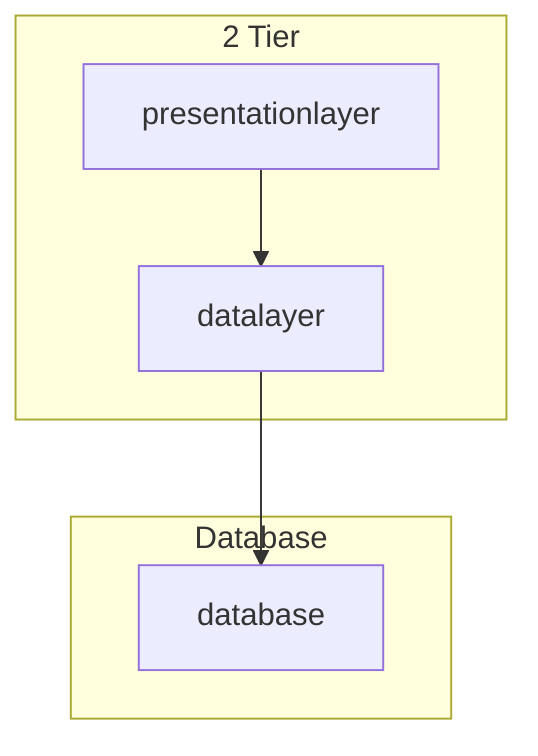
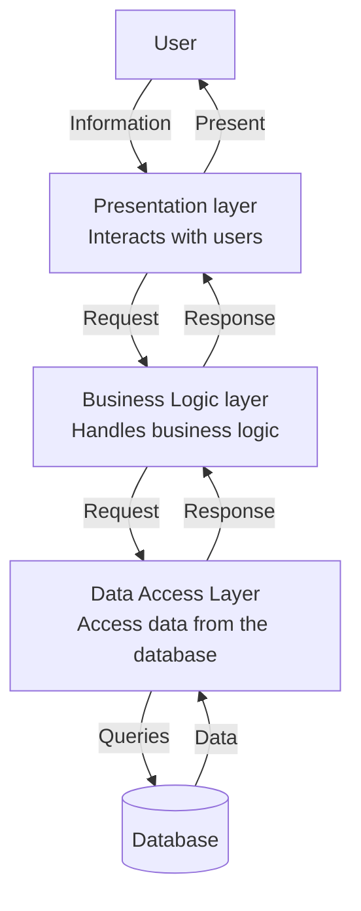
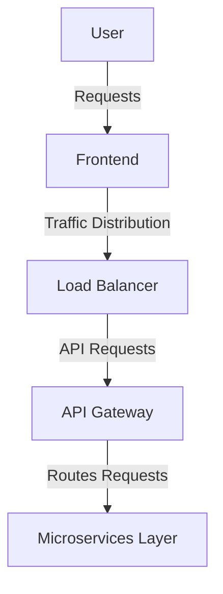

Software architecture is the structure of a system. The choices you make profoundly impact scalability, performance, and maintainability.

## Key design considerations

- **Scalability** — handles increased data or traffic
- **Maintainability** — how easily the system can be updated or fixed
- **Performance** — efficiency and responsiveness under load

## Architectural patterns

### Monolithic

One unified block with tightly coupled components.

**Pros:** easy to develop and deploy initially, simple to manage at small scale.

**Cons:** hard to scale, difficult to maintain as the system grows, high risk of cascading failure.

**Use for:** small-scale applications, startups, simple CRUD apps.

### Layered (N-tier)

Organizes the system into presentation, business logic, and data layers.

**Pros:** clear separation of concerns, easier to scale and maintain individual layers.

**Cons:** each layer adds overhead; layers can still become tightly coupled.

**Use for:** enterprise applications, CRM systems, banking and financial systems.

### Client–server

Clients request resources from a central server.

### Microservices

Break the system into smaller, independently deployable services focused on business domains.

**Pros:** loosely coupled, flexible tech stack, better fault tolerance, independent scaling.

**Cons:** increased complexity in communication, coordination, DevOps, and monitoring.

**Use for:** large-scale applications that need independent development and cloud-native deployment.

### Event-driven

Services communicate through events rather than direct calls.

**Pros:** loosely coupled, highly scalable, real-time processing, complex workflows.

**Cons:** debugging and tracing are harder, eventual consistency, ordering guarantees.

**Use for:** real-time data processing, IoT, financial trading platforms.

## Choosing the right architecture

1. **Business needs** — what problem are we solving?
2. **Scalability** — how much traffic or data must the system handle?
3. **Performance** — how fast must the system respond?
4. **Maintainability** — how easy will updates and bug fixes be?

## Multi-tiered architecture

Organizes applications into independent layers for better scalability, performance, and security.

### 2-tier

Client layer and database layer on the same machine or network.

**Pros:** simple, fast for small scale.

**Cons:** poor scalability, security risks from direct DB access.

Example: desktop application querying a local SQL database.

### 3-tier

Adds a business logic layer between presentation and data access.

**Pros:** better separation of concerns, improved scalability and security.

**Cons:** slightly higher latency from extra processing.

Example: traditional web applications.

### N-tier

Extends beyond 3 tiers with specialized layers: caching, API gateway, microservices, etc.

**Pros:** handles high traffic and complex business logic, independent scaling of services.

Example: microservices-based enterprise software.

### Performance and scalability impact

- More layers can mean higher latency if not optimized — use caching (Redis, Memcached) and load balancing
- **Vertical scaling** — add resources to a single server
- **Horizontal scaling** — add more servers and distribute load

## Microservices in depth

Small, independent services each handling a different business function.

**Principles:**

- Decompose by business domain (Domain-Driven Design)
- Single responsibility per service
- Data ownership per service
- Independently deployable
- Well-defined APIs
- Right granularity — too large becomes a monolith, too small becomes overly complex

### Communication

- **Synchronous** — REST (higher latency), gRPC (binary, Protocol Buffers, immediate responses)
- **Asynchronous** — message queues (RabbitMQ, SNS/SQS), event-driven patterns

Use the right mix of both.

### Challenges

- Distributed databases and eventual consistency
- Distributed tracing across services
- Network overhead — mitigate with caching and request aggregation
- Service-to-service authentication and security

### Scaling strategies

- Horizontal scaling with multiple instances
- Auto-scaling based on CPU and request load
- Database sharding by unique key
- Read replicas for read-heavy workloads

Examples: Netflix, Uber, Amazon.

## Event-driven architecture

System components communicate through events for asynchronous, loosely coupled processing.

### Synchronous vs asynchronous

| | Synchronous | Asynchronous |
| --- | --- | --- |
| Pattern | Request → response (blocking) | Non-blocking, decoupled |
| Coupling | Tight | Loose |
| Example | Traditional HTTP APIs | Message queues, event brokers |

### Pub/sub vs event streaming

- **Pub/sub** — events broadcast to multiple subscribers (RabbitMQ, AWS SNS). Good for real-time comms.
- **Event streaming** — events stored and consumed in order; consumers process at different times (Kafka, AWS Kinesis). Good when event history and ordering matter.

### Components

- **Event producers** — generate events
- **Event brokers** — transmit and store events
- **Event consumers** — react to events
- **Event storage** — log-based persistence for replay

### Challenges

- Eventual consistency
- Ordering guarantees with multiple consumers
- Fault tolerance and retries (dead letter queues)
- Debugging complexity across microservices

### Best practices

- Idempotent consumers — processing the same event twice has no side effects
- Dead letter queues for failed messages
- Choose the right broker for durability, ordering, and scale
- Event versioning for schema changes

**Use cases:** logging and auditing, real-time communications, microservices decoupling, IoT sensor data, e-commerce order processing.

Back to [System Design](/posts/system-design.html).
