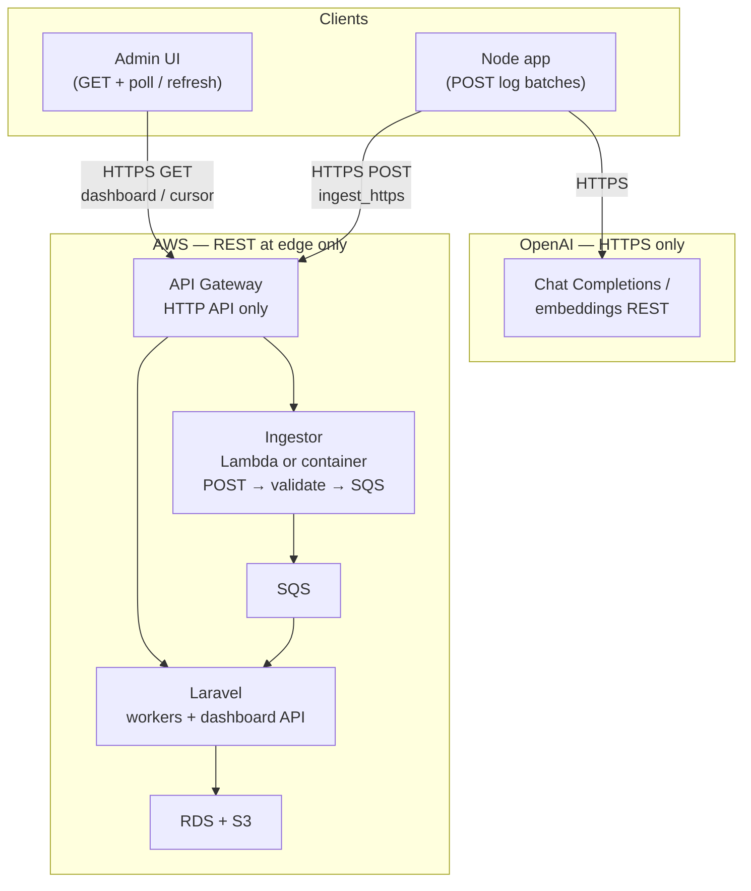
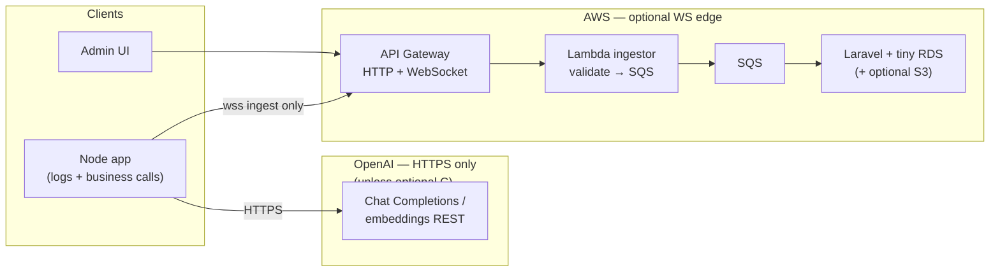
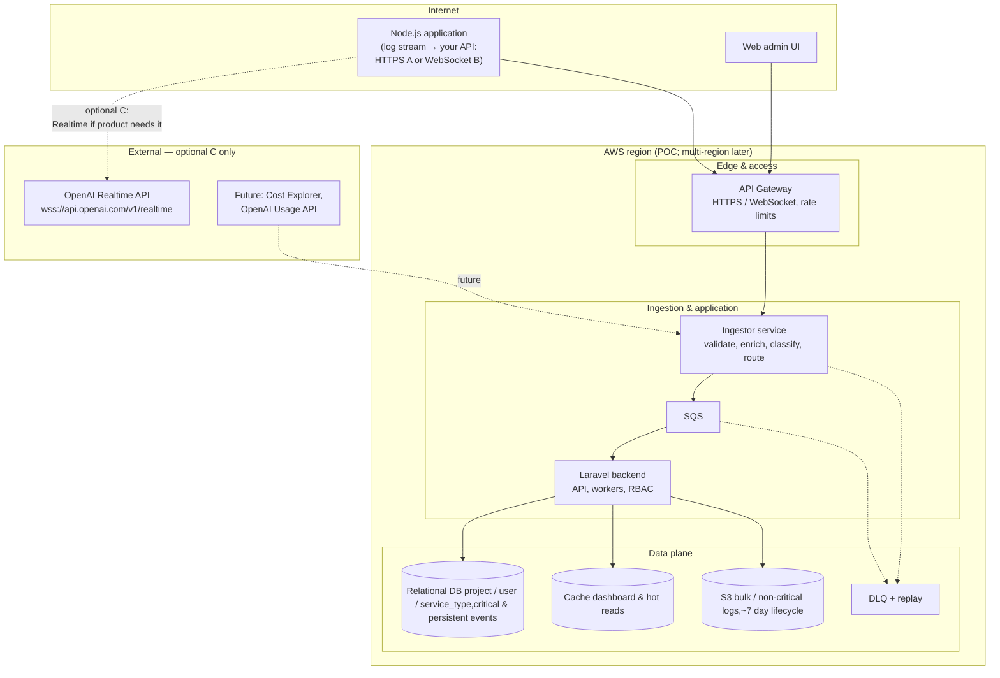

A system to monitor errors, manage project costs, and track separate systems that use OpenAI and AWS.

## Architecture options

Three transport options for ingest and OpenAI integration. All share the same core backend (SQS → Laravel → RDS + S3).

| | **A. HTTPS-only** | **B. WebSocket ingest** | **C. OpenAI Realtime** |
| --- | --- | --- | --- |
| **Role** | Default: `POST` logs, `GET` dashboard + polling | Add `wss://` to your API for server push | Add OpenAI Realtime for voice sessions |
| **OpenAI (product)** | HTTPS chat/embeddings only | Same — no Realtime unless **C** added | Realtime token/session charges |
| **AWS edge** | API Gateway HTTP API only | HTTP + WebSocket routes | Same as A or B for your API |
| **Trade-off** | Simplest ops; polling overhead | Live updates; WS connection billing | Extra OpenAI cost; keep ingest WS separate from Realtime WS |
| **Est. AWS/month (POC)** | ~$35–110 | ~$40–120 | Same AWS as A or B; Realtime billed by OpenAI |

### A. Original — HTTPS-only ingest (default)

- Ingest via `POST /ingest/...` with API key auth
- Admin dashboard via `GET /api/projects/.../events` with polling or refresh
- OpenAI via HTTPS chat completions / embeddings only
- API Gateway HTTP API (REST) only



Tag transport as `ingest_https` in metrics.

### B. Optional — WebSocket ingest

Browser/Node connects via `wss://` to **your API** only. Never confuse with `wss://api.openai.com/v1/realtime` (that is **C**).



Tag transport as `ingest_websocket`.

### C. Optional — OpenAI Realtime API

Separate WebSocket to OpenAI for voice/low-latency product flows. Observability ingest stays A or B.



Name Realtime connections `openai_realtime_ws` in code so they never mix with `ingest_websocket`.

## Functional requirements

| ID | Requirement | A | B | C |
| --- | --- | --- | --- | --- |
| F1 | Ingest observability events via HTTPS `ingest_https` | Yes | Yes | Yes |
| F2 | Optional WebSocket ingest `ingest_websocket` | No | Yes | No |
| F3 | Super-admin UI: dashboard per project with persistent messages | Yes | Yes | Yes |
| F4 | Log identity: per project, per user, per service type | Yes | Yes | Yes |
| F5 | Capture text-to-voice and onboarding correction counts | Yes | Yes | Yes |
| F6 | Toggle logging on/off per project at ingestor | Yes | Yes | Yes |
| F7 | Supplemental metrics: latency, token usage, outcomes | Yes | Yes | Yes |
| F8 | Integrate AWS Cost Explorer (later) | Yes | Yes | Yes |
| F9 | Integrate OpenAI Usage API (later) | Yes | Yes | Yes |
| F10 | Optional OpenAI Realtime sessions | No | No | Yes |

## Non-functional requirements

| ID | Requirement | A | B | C |
| --- | --- | --- | --- | --- |
| NF1 | Scalability: design for growth; POC starts small | Yes | Yes | Yes |
| NF2 | Horizontal scaling path | Yes | Yes | Yes |
| NF3 | Regional placement (start single region) | Yes | Yes | Yes |
| NF4 | API Gateway rate limiting | Yes | Yes | Yes |
| NF5 | Acceptable latency for OpenAI and cross-component calls | Yes | Yes | Yes |
| NF6 | Cache for dashboard / hot reads | Yes | Yes | Yes |
| NF7 | DLQ + replay for failed ingest | Yes | Yes | Yes |
| NF8 | TLS (HTTPS / WSS) for client ↔ API | Yes | Yes | Yes |
| NF9 | RBAC: least-privilege admin | Yes | Yes | Yes |
| NF10 | Logging hygiene: `x-request-id`; no confidential prompt bodies | Yes | Yes | Yes |
| NF11 | Sensitive/token data per security policy | Yes | Yes | Yes |
| NF12 | Authentication on admin and ingest paths | Yes | Yes | Yes |
| NF13 | Live dashboard updates without aggressive polling | Partial | Yes | Partial |

## Constraints

| ID | Constraint | A | B | C |
| --- | --- | --- | --- | --- |
| C1 | Respect OpenAI API limits | Yes | Yes | Yes |
| C2 | AWS POC: low cost, single region, scale-out design | Yes | Yes | Yes |
| C3 | Message broker — Amazon SQS | Yes | Yes | Yes |
| C4 | Laravel for persistence and APIs | Yes | Yes | Yes |
| C5 | Critical events → relational DB | Yes | Yes | Yes |
| C6 | Non-critical logs → S3 (~7-day retention) | Yes | Yes | Yes |
| C7 | Observability does not require OpenAI Realtime | Satisfied | Satisfied | Additive only |

## Event schema

```json
{
  "schema_version": "1.0",
  "event_id": "550e8400-e29b-41d4-a716-446655440000",
  "event_type": "observability.log.v1",
  "severity": "info",
  "occurred_at": "2026-04-08T12:34:56.789Z",
  "project_id": "proj_123",
  "user_id": "usr_456",
  "service_type": "counsellor",
  "request_id": "req-abc-789",
  "tokens_used": 142,
  "latency_ms": 380,
  "has_correction": false,
  "has_recommended": false,
  "has_appointment": false,
  "provider": "openai",
  "model": "gpt-4o-realtime-preview"
}
```

## Load balancing and scaling

When latency rises from growing usage:

- **API Gateway** scales the edge automatically
- Add **multiple ingestor instances** behind the gateway
- Add **multiple Laravel API instances** for dashboard reads
- **Per region:** deploy replicas where customer data lives
- **SQS workers:** scale consumer count rather than load-balancing the queue itself
- **Data layer:** read replicas, RDS Proxy, cached dashboard reads, tenant/region partitioning before expecting load balancers to fix DB-bound latency

Back to [System Design](/posts/system-design.html).
