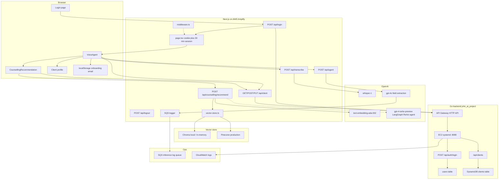
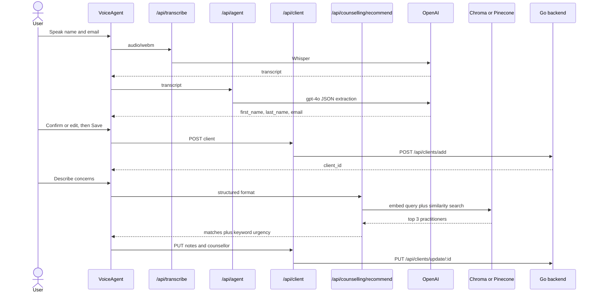
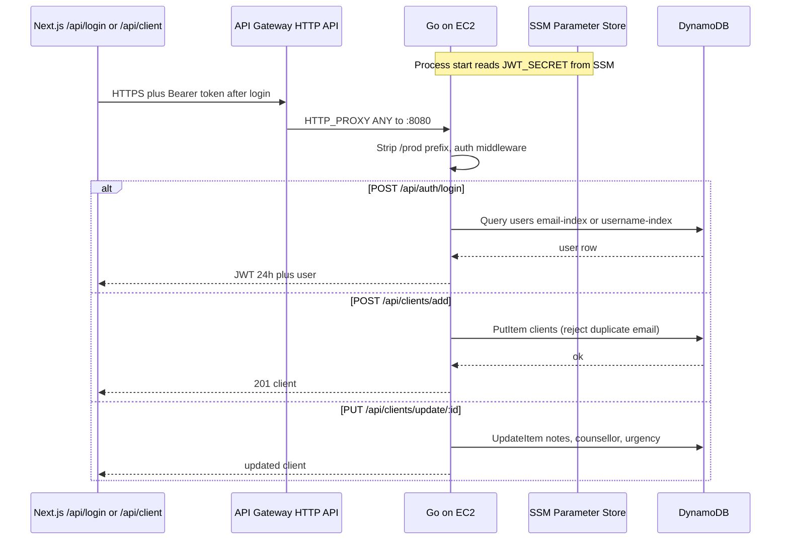

A voice-first client onboarding and counsellor-matching app for a New Zealand counselling practice. A staff member (or client) signs in, speaks their name and email, reviews what the model extracted, then describes why they are seeking help so the system can recommend a matching practitioner and persist the intake on a client record.

The product is two repositories. The **frontend** (`WhatsTheScore`) is a Next.js 14 App Router app on AWS Amplify: it talks to OpenAI for speech and language, a vector store for practitioner search, and a BFF layer that proxies auth and client persistence. The **backend** (`john_ai_project`) is a Go HTTP API on EC2 behind API Gateway, with DynamoDB for users and clients. JWT login and client CRUD live there.

Calendar booking and the dental image-screening service mentioned in the frontend README are not part of the running product.

## What it does

The product is an **intake workflow**, not a full practice-management suite.

1. **Sign in.** Credentials go to the Go backend; the Next.js app stores an HTTP-only session cookie.
2. **Create account by voice.** The browser records audio (WebM), Whisper transcribes it, and GPT-4o extracts first name, last name, and email. The user can edit before save.
3. **Persist the client.** A BFF route (`/api/client`) proxies create/read/update to the Go API.
4. **Match a counsellor.** The client describes their concerns in free text. Semantic search over seven seeded practitioners returns ranked matches plus a keyword-based urgency level. Choosing a counsellor writes `requested_counsellor` and `urgency` back to the profile. The intake text is stored as initial consult notes.
5. **Resume after refresh.** The saved email is kept in `localStorage` so the profile can be reloaded without repeating voice onboarding.

## Architecture



### Request path in practice



The Next.js app is a **BFF**: the browser never calls OpenAI or the Go API directly (except that `NEXT_PUBLIC_BACKEND_URL` is also available on the client). Secrets stay in Amplify env vars / server routes. Vector search is switched with `USE_LOCAL_VECTOR_DB`: Chroma locally, Pinecone in production. Both use the same OpenAI embedding model so indexes stay compatible.

Production traffic to the Go API goes **Amplify → API Gateway HTTP API (`$default` proxy) → EC2 `:8080`**. Local frontend work typically points `BACKEND_URL` at `http://localhost:8080` (or `8081`) and skips the gateway.

## Frontend directory and file structure

```
WhatsTheScore/
├── app/                          Next.js App Router UI and API routes.
│   ├── layout.tsx                Root layout: Unsplash background and page chrome.
│   ├── page.tsx                  Authenticated home. Checks auth cookies, enforces a 30-minute session, renders VoiceAgent.
│   ├── globals.css               Global Tailwind / CSS entry.
│   ├── login/
│   │   └── page.tsx              Sign-in form. Posts email/password to /api/login, then redirects home.
│   ├── components/
│   │   ├── VoiceAgent.tsx        Main onboarding UI: mic recording, transcript review, save client, counsellor finder, profile.
│   │   ├── CounsellingRecommendation.tsx  Concern textarea, match request, persist notes and chosen counsellor.
│   │   ├── Client.tsx            ClientData type plus read-only profile fields.
│   │   ├── Client.test.tsx       Jest tests for the profile component.
│   │   ├── Logo.tsx              positive THOUGHT Counselling wordmark.
│   │   └── ResetOnboardingButton.tsx  Clears localStorage and resets VoiceAgent without logging out.
│   └── api/
│       ├── login/route.ts        Proxies login to the Go backend and sets httpOnly authToken plus loginTime cookies.
│       ├── logout/route.ts       Deletes auth cookies locally (does not call the backend yet).
│       ├── transcribe/route.ts   Accepts recorded audio and returns a Whisper transcript.
│       ├── agent/route.ts        Asks gpt-4o to extract first_name, last_name, email as JSON; logs to SQS.
│       ├── client/route.ts       BFF for GET-by-email, POST create, and PUT notes/counsellor against the Go API.
│       ├── client/route.test.ts  Jest tests for client proxy create/update behaviour.
│       └── counselling/
│           └── recommend/route.ts  Runs practitioner matching; GET returns vector-store health/config.
├── lib/
│   ├── counselling/
│   │   ├── types.ts              Practitioner, issue input, and recommendation TypeScript types.
│   │   ├── sample-practitioners.ts  Seven hardcoded counsellors used to seed the vector index.
│   │   ├── embeddings.ts         OpenAI embeddings helper, document mapping, seed and search helpers.
│   │   ├── vector-store.ts       Chroma vs Pinecone switch, plus a Pinecone v7 upsert fallback.
│   │   ├── pinecone-client.ts    Pinecone client singleton and serverless index bootstrap.
│   │   └── agent.ts              LangGraph ReAct agent (text) and keyword-urgency structured matcher (what the UI uses).
│   ├── logging/logging.ts        Fire-and-forget SQS logger for model inference events.
│   ├── onboardingStorage.ts      localStorage helpers so onboarding survives a refresh.
│   └── onboardingStorage.test.ts Jest tests for those helpers.
├── scripts/
│   └── seed-practitioners.ts     CLI to embed sample practitioners into Chroma or Pinecone.
├── e2e/
│   ├── login.spec.ts             Playwright: login form and invalid-credentials error.
│   └── clientonboard.spec.ts     Playwright: mocked full onboarding plus counsellor selection.
├── terraform/                    Former S3/CloudFront stack; hosting resources are commented out. State backend remains.
│   ├── main.tf                   Disabled static-hosting resources (Amplify replaced them).
│   ├── backend.tf                S3 plus DynamoDB remote state config.
│   ├── backend.tf.example        Example remote-state config.
│   ├── state-bucket.tf           Terraform state bucket / lock table definitions.
│   ├── bootstrap-state.sh        One-shot script to create the state backend.
│   └── README.md                 Explains why frontend infra moved to Amplify.
├── .github/workflows/
│   ├── test.yml                  Jest on every push/PR; Playwright allowed to fail until stable.
│   └── deploy.yml                Old S3/CloudFront deploy; manual trigger only, Amplify is the live path.
├── middleware.ts                 Intended auth gate; currently allows unauthenticated page requests through.
├── middleware.ts.disabled        Previous middleware variant kept alongside the active file.
├── amplify.yml                   Amplify build: pnpm install, Jest, Next build, cache headers.
├── next.config.mjs               standalone output for Amplify SSR; injects env into the server bundle; chroma externals.
├── playwright.config.ts          E2E config; starts the Next server automatically.
├── jest.config.js                Next-aware Jest, jsdom, ignores e2e/.
├── jest.setup.ts                 Testing Library / jest-dom setup.
├── tailwind.config.ts            Tailwind content paths and theme tweaks.
├── postcss.config.mjs            PostCSS pipeline for Tailwind.
├── tsconfig.json                 TypeScript compiler options and path aliases.
├── package.json                  Scripts and dependencies (Next, OpenAI, LangChain, Pinecone, Playwright).
├── pnpm-workspace.yaml           Single-package pnpm workspace.
├── .env.example                  Documented env vars (OpenAI, Chroma/Pinecone, backend URL).
└── README.md                     Deployment, env, and local-dev guide.
```

## Backend

The Go service is the system of record for **staff users** and **client intake records**. It does not run Whisper, embeddings, or counsellor matching — those stay in the Next.js BFF. Layers are handler → service → repository → DynamoDB, with `net/http` `ServeMux` (no Gin/Echo). Auth is JWT (HS256, 24 hours) after bcrypt password check.

### What the API does

**Public**

- `GET /health` — liveness for the load path and systemd health.
- `POST /api/auth/register` — create a user (`username`, `email`, `password` ≥ 8 chars, `first_name`, `last_name`). Returns a JWT plus the user (password hash omitted).
- `POST /api/auth/login` — `login` may be email or username. Returns `{ token, user }`.

**Protected** (`Authorization: Bearer <token>`)

- `GET /api/auth/me` — current user from the token.
- `GET /api/clients` — scan all clients.
- `GET /api/clients/{id}` — get by primary key.
- `GET /api/clients/by-email?email=` — GSI lookup; email is normalised to lowercase.
- `GET /api/clients/active` / `GET /api/clients/inactive` — status GSI.
- `POST /api/clients/add` — create. Required: `first_name`, `last_name`, `email`. Duplicate email → 409.
- `PUT`/`PATCH /api/clients/{id}` and `/api/clients/update/{id}` — partial update. The frontend writes notes, `requested_counsellor`, and `urgency` here. The handler accepts camelCase and other JS aliases so the BFF payload does not have to match Go field names exactly.

JSON responses add display helpers `name` (first + last) and `initial_consult_notes` (first note body) without storing those as DynamoDB attributes.

A request middleware strips `/prod`, `/dev`, and `/staging` prefixes so API Gateway stage paths still hit the same handlers, recovers panics to JSON 500s, and optionally writes each request to CloudWatch.

### Data model

**`clients`** — partition key `id` (UUID). Pay-per-request in AWS.

| Attribute | Role |
| --- | --- |
| `first_name`, `last_name`, `email` | Identity; email unique via `email-index` |
| `phone`, `date_of_birth`, `address`, emergency contacts | Optional demographics |
| `status` | `active` / `inactive` / `archived`; `status-index` |
| `requested_counsellor`, `urgency`, `next_appointment` | Matching outcome from the frontend |
| `notes[]` | `{ date, client_id, note }`; first entry is the initial consult |
| `created_at`, `updated_at` | RFC3339 |

**`users`** — partition key `id`. GSIs: `email-index`, `username-index` (local `create-db` also builds `role-index`). Passwords are bcrypt hashes (`password_hash` is omitted from JSON). Roles are `user` or `admin`; `is_active` gates login.

### Backend request path



### Backend directory and file structure

```
john_ai_project/
├── cmd/
│   ├── server/main.go            API process: construct router, graceful shutdown.
│   ├── create-db/main.go         Create clients and users tables (local DynamoDB or AWS).
│   ├── seed-db/main.go           Seed test clients and users.
│   └── example/main.go           Example client-service usage.
├── internal/
│   ├── db/connection.go          DynamoDB client: DYNAMODB_ENDPOINT for local, IAM role on EC2.
│   ├── repository/
│   │   ├── client_repository.go  Client struct, Scan/Query/Put/Update on `clients`.
│   │   └── user_repository.go    User struct, GSI lookups on `users`.
│   ├── service/
│   │   ├── client_service.go     Validation, UUID, email uniqueness, partial updates.
│   │   ├── client_service_test.go
│   │   ├── auth_service.go       Register/login, bcrypt, JWT HS256 (issuer john-ai-project).
│   │   └── auth_service_test.go
│   ├── handler/
│   │   ├── client_handler.go     REST mapping; JS alias unmarshalling on updates.
│   │   ├── client_handler_test.go
│   │   ├── auth_handler.go       Register, login, me, Bearer middleware.
│   │   ├── auth_handler_test.go
│   │   └── response.go           JSON helpers.
│   ├── router/router.go          ServeMux routes, stage-prefix strip, request logging.
│   └── logger/cloudwatch.go      PutLogEvents for API requests.
├── infra/
│   ├── terraform/
│   │   ├── main.tf               Wires IAM, DynamoDB, EC2, API Gateway; S3 remote state.
│   │   ├── modules/dynamodb/     `clients` and `users` tables plus GSIs.
│   │   ├── modules/ec2/          Instance, SG (8080 + SSH), IAM profile, user_data systemd unit.
│   │   ├── modules/api-gateway/  HTTP API, CORS *, $default proxy to EC2, access logs.
│   │   └── modules/iam/          Deploy and admin IAM users/groups.
│   └── cloudformation-archive/   Former CFN templates kept for reference.
├── .github/workflows/
│   ├── ci.yml                    go build and go vet on push/PR to main.
│   ├── deploy-backend.yml        Version-tag Linux binary, upload to S3, SSM copy/restart on EC2.
│   └── terraform.yml             Version-tag terraform plan/apply on infra/terraform.
├── scripts/                      JWT SSM setup, CloudWatch/API Gateway log helpers, OIDC setup.
├── docs/                         Auth, JWT, EC2, CloudWatch, Postman, GitHub OIDC.
├── docker-compose.yaml           DynamoDB Local plus optional Delve debug backend container.
├── Dockerfile / Dockerfile.debug
├── Makefile                      Local setup, build, tests, terraform, API Gateway helpers.
├── go.mod
└── README.md                     Local and AWS runbook.
```

### Local development

```bash
make setup        # DynamoDB Local in Docker, create tables, seed
make run-server   # API on HTTP_PORT (Makefile default 8081; docker-compose uses 8080)
```

`DYNAMODB_ENDPOINT=http://localhost:8000` selects DynamoDB Local. Unset it in AWS so the SDK uses the regional endpoint and the instance role.

### Production deploy

Terraform (state in `duskaotearoa-terraform-state`, key `john-ai-project-backend/terraform.tfstate`) provisions:

- **DynamoDB** `clients` and `users` (on-demand).
- **EC2** Amazon Linux 2, systemd unit `john-ai-backend.service` at `/opt/john-ai-project/server`, port 8080. `JWT_SECRET` is read from SSM `/john-ai-project/jwt-secret` at process start. CloudWatch agent tails application logs.
- **API Gateway HTTP API** with `$default` `HTTP_PROXY` to the instance URL, CORS allow-all, throttling, access logs.

Pushing a `v*.*.*` tag runs tests, builds a linux/amd64 binary, and restarts the service over SSM. Infra changes on the same tag pattern go through the Terraform workflow.
